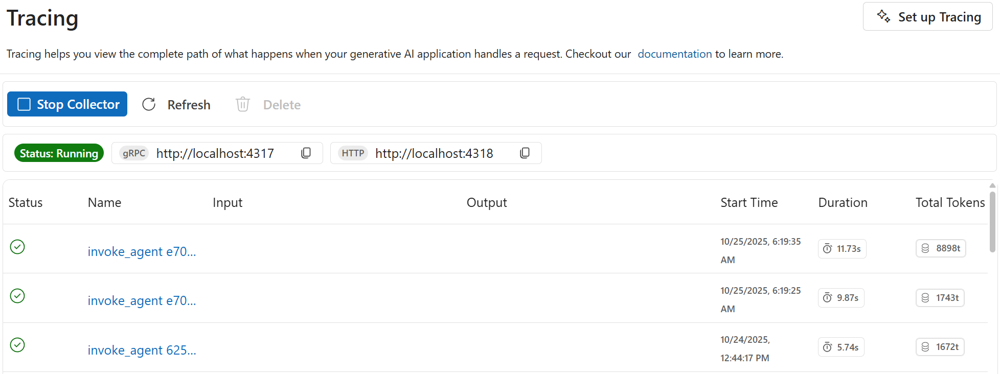
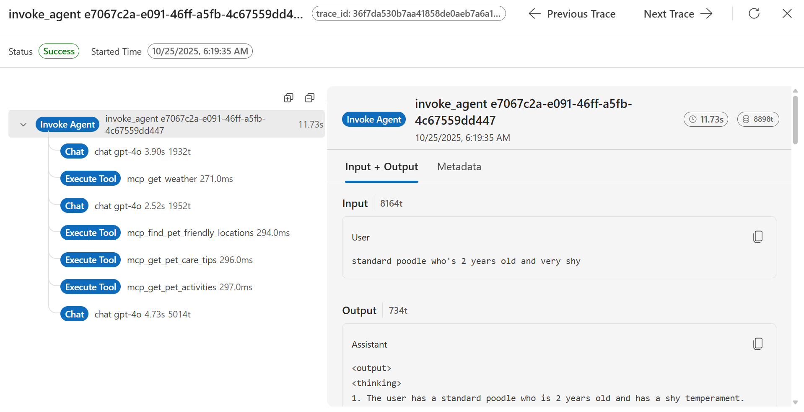

# 🐕 Module 5: Trace Agent Responses

Tracing reveals the decision path your agent takes — which helps debug and improve its reasoning when generating suggestions. Your goal is to enable tracing to understand how your Pet Planner processes information step-by-step.

> [!WARNING]
>Do not stop the debugger. The debugger should remain running for the rest of this workshop. If the debugger is stopped, the Pet Planner MCP server will no longer run locally which prevents server access for the agent.

## 🧩 Instructions

1. Open the **pet-planner-agent.py** file so that GitHub Copilot can use the agent file as context.
1. Open the GitHub Copilot chat window via the **Toggle Chat** icon.
1. Click the **Set Mode** drop-down and select **Agent**.
1. Click the **Pick Model** drop-down and select **Claude Sonnet 4.5**.
1. In the chat window, enter the **GitHub Copilot Prompt** provided below and submit.
1. Review the response from GitHub Copilot. Given the non-deterministic nature of language models, responses will vary.
1. If GitHub Copilot requests to open the **Tracing Viewer**, respond with **Yes** OR click the provided button to access the **Tracing Viewer**. Alternatively, you can open the **AI Toolkit** extension and navigate to **Agent and Workflow Tools > Tracing**. If prompted to allow pubic and private networks to access this app, select **Allow**.
1. In the **Tracing Viewer** confirm that the **Collector** has started (i.e. blue button under **Tracing**). If the **Collector** has not started, click **Start Collector**.
1. In the **Terminal**, run the command `python pet-planner-agent.py`.
1. View the traces in the **Tracing Viewer**.
1. If tracing setup is successful, select **Keep** in GitHub Copilot to keep the file changes. Tracing setup is successful if the following conditions are met (**note**: example images are provided below):
    1. There are no errors in the terminal.
    1. A trace is logged in the **Tracing Viewer**.
    1. A value is provided in the **Tracing Viewer** for **Start Time**, **Duration**, and **Total Tokens**.
    1. Trace details include **Chat** (with **Input + Output** and **Metadata**).,
    1. Trace details include **Execute Tool** with **Metadata**.

## 💬 GitHub Copilot Prompt

`Enable local tracing in my Pet Planner agent.`

## 🔍 What’s Happening

Tracing logs the model’s chain of reasoning, API calls, and response generation steps — useful for transparency and optimization.

GitHub Copilot calls 1 tool:

- Get Tracing Code Generation Best Practices

## ✅ Checkpoint

You can now see a visual/textual trace of your Pet Planner’s thought process.

## 🐾 Next Step

Continue to [Evaluate Agent Responses](/Workshops/PetPlanner/Modules/06-evaluate-agent-responses.md)
