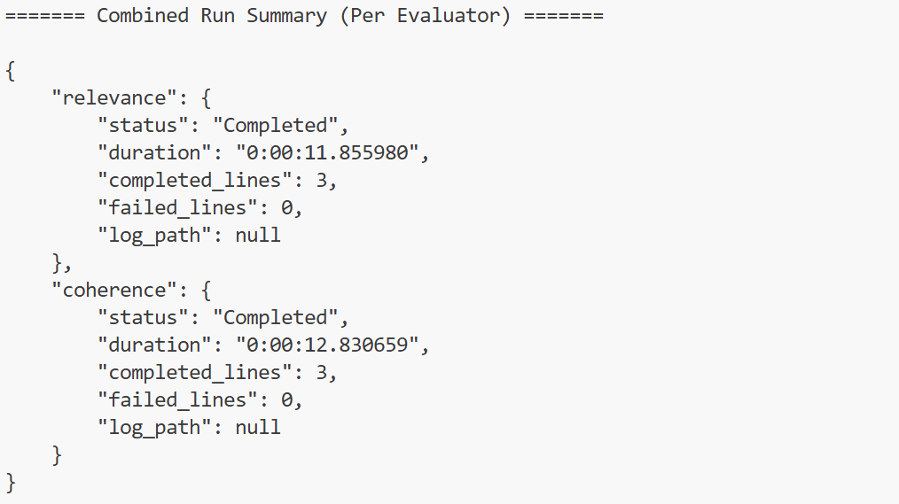
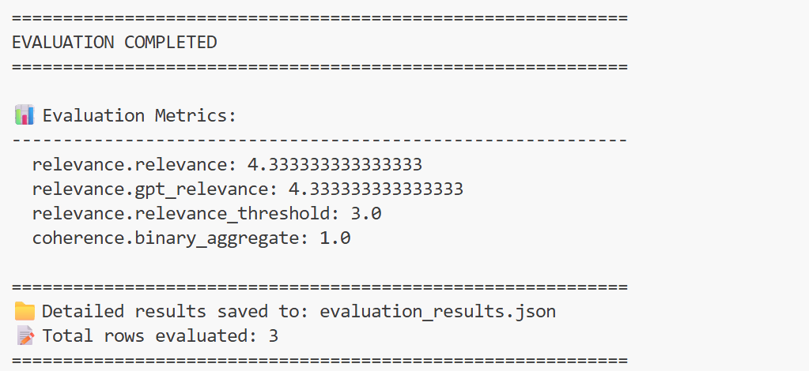

# 🐕 Module 6: Evaluate Agent Responses

Evaluating responses ensures your agent meets expectations — helpful, playful, and reliable — while handling edge cases gracefully. Your goal is to Assess your Pet Planner’s performance.

> [!WARNING]
>Do not stop the debugger. The debugger should remain running for the rest of this workshop. If the debugger is stopped, the Pet Planner MCP server will no longer run locally which prevents server access for the agent.

## 🧩 Instructions

1. Open the **pet-planner-agent.py** file so that GitHub Copilot can use the agent file as context.
1. Open the GitHub Copilot chat window via the **Toggle Chat** icon.
1. Click the **Select Mode** drop-down and select **Agent**.
1. Click the **Pick Model** drop-down and select **Claude Sonnet 4.5**.
1. In the chat window, enter the **GitHub Copilot Prompt** provided below and submit.
1. Review the response from GitHub Copilot. Given the non-deterministic nature of language models, responses will vary.
1. If GitHub Copilot requests that you confirm the recommended evaluators for evaluation, respond: `Only relevance and coherence`.
1. If GitHub Copilot inquiries whether to create a dataset with queries, respond: `Yes, only create 3 rows of data.`.
1. If GitHub Copilot inquiries whether to create a dataset with responses, respond: `Yes, collect responses.`.
1. You may be prompted to allow GitHub Copilot to install any required dependencies. As a precaution, review the request before selecting **Allow**. Selecting **Allow** enables GitHub Copilot to install dependencies on your behalf. It's recommended to follow up with an additional prompt such as `install in the uv virtual environment` before selecting **Allow**. Otherwise, GitHub Copilot will create it's own virtual environment. GitHub Copilot may occasionally  forget to run commands in the virtual environment, but after a few tries, it may correct itself and retry to run a command. In addition, if GitHub Copilot runs into any errors while completing the evaluation tasks, it will try to correct itself and request your permission to re-run files.
1. After GitHub Copilot completes it's task of creating a test dataset, you'll be prompted to confirm the evaluation plan. Review and either respond `yes` or respond with your requested changes.
1. After GitHub Copilot creates the evaluation file, you may be prompted to allow GitHub Copilot to run the evaluation file. If you'd prefer to run the file yourself, select **Skip**, otherwise select **Allow**.
1. Review the evaluation results in the terminal. Alternatively, open the evaluation results JSON file (e.g. `evaluation_results.json` although yours may be named differently) and open the **Command Palette** (CTRL+SHIFT+P). Type `Format Document` to format the JSON file for a better view of the file's content. As a bonus, you can prompt GitHub Copilot to `create a markdown report of the evaluation results`.
1. If evaluation setup is successful, select **Keep** in GitHub Copilot to keep the file changes. Evaluation setup is successful if the following conditions are met (**note**: example images are provided below):
    1. The evaluation file created by GitHub Copilot leverages the **Azure AI Evaluation SDK**, the SDK's built-in **relevance** and **coherence** evaluators, and your Azure AI Foundry model deployment and endpoint.
    1. There are 3 completed lines per evaluator in the terminal output.
    1. The relevance evaluator has a numeric value for each row of data.
    1. The coherence evaluator has a numeric value for each row of data.

## 💬 GitHub Copilot Prompt

`Add evaluation to my agent.`

## 🔍 What’s Happening

Copilot compares your agent’s responses against best practices and performance criteria, surfacing improvements in tone, relevance, or correctness.

GitHub Copilot calls 2 tools:

- Evaluation Planner
- Get Evaluation Agent Runner Best Practices
- Get Evaluation Code Generation Best Practices
- Get AI Model Guidance

## ✅ Checkpoint

You now have synthetic data ready to evaluate your Pet Planner’s responses. You should also have an evaluation script that runs the recommended evaluators, and results from your latest evaluation run.

## 🐾 Workshop Complete

🎉 You’ve built, connected, and optimized your Pet Planner agent — ready to sniff out the perfect playdate!